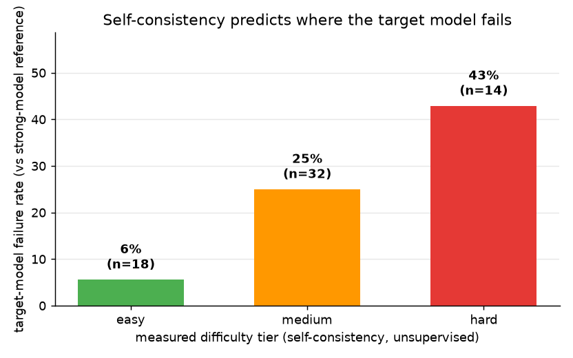

# Automated Eval Dataset Generator

Turns raw traffic for an LLM assistant into a **labeled, difficulty-scored, versioned eval set** —
where difficulty isn't assigned by hand, it's **measured from the target model's own uncertainty**
and validated against where the model actually fails.

> 🎯 **Project purpose (measured, see Results):** *"An eval-set generator that mines
> assistant traffic into intents, auto-labels with confidence routing to a human-review queue, and
> scores case difficulty by target-model self-consistency — an unsupervised signal that predicted
> an 8× difference in real failure rate between its easy and hard tiers."*

The system under eval is a **real growth-analytics assistant** (Claude Haiku); labeling and
judging use a strong model (Claude Opus). Needs `ANTHROPIC_API_KEY` (in `.env`) to *build* a
dataset — the shipped `eval_set.json` (71 cases) and the review/coverage API run with **no key**.

---

## The headline: difficulty you can defend

Most eval sets label difficulty by fiat ("adversarial = hard"). This project measures it:

1. Sample the target model **K=4 times** at temperature on each question.
2. **Difficulty = how much its own answers disagree** (1 − mean pairwise cosine of the answer
   embeddings). High disagreement = the model is uncertain = hard. No gold label needed.
3. Bin into tiers (thresholds calibrated to the observed distribution, ~terciles).

That signal is only worth something if it's **not circular** — so the proof grades correctness
*independently* (target's deterministic answer vs a strong-model reference, judged) and checks
whether the unsupervised tiers predict the supervised outcome:



```
── difficulty proof: does self-consistency predict target-model failure? ──
tier        n   failures   failure rate
easy       18          1          5.6%
medium     32          8         25.0%
hard       14          6         42.9%
```

An unsupervised signal predicting a supervised one is a real property of the case — the hard tier
fails **8× more often** than the easy tier. A favorite hard-tier catch (difficulty 0.305, and the
model did get it wrong):

> *"srm check failing, 50.4/49.6 split on 1.2M users, is this actually a problem or am i being
> paranoid"* — at n=1.2M that tiny-looking imbalance is a massive sample-ratio mismatch (~9σ).

## Pipeline

```
LLM-synthesized assistant traffic (8 topic × persona batches, embedding-deduped)
   │
   ▼
semantic embeddings (all-MiniLM-L6-v2, local) → HDBSCAN → 5 intents + long-tail bucket
   │
   ▼
auto-label: strong model proposes reference + self-rated confidence + ambiguity flag
   │            └─ ambiguous / low-confidence → human-review queue (44 of 71 cases)
   ▼
difficulty: sample target K=4 → self-consistency score → easy/medium/hard tier
   │            └─ + independent correctness grade  (the proof above)
   ▼
augment thin intents with genuine LLM paraphrase/adversarial variants (deduped vs pool)
   │
   ▼
eval_set.json (versioned) · coverage heatmap (intent × measured tier) · build_report.json
```

## Quick start

```bash
git clone <this-repo> && cd eval-dataset-generator
make install     # uv venv + deps (Python 3.12)
make test        # 7 offline unit tests — no key, no model download
make run         # review-queue + coverage API on :8000, serves the shipped eval_set.json
make build       # regenerate the whole dataset from scratch — needs ANTHROPIC_API_KEY in .env
```

`.env` is gitignored (`cp .env.example .env`, paste your key) — your key never leaves your
machine. A full `make build` (60 mined + augmentation, ~450 model calls) costs roughly a dollar.

## What the build actually found (all measured)

- **5 intents discovered** by HDBSCAN over the mined traffic: `ratio/sample/split` (SRM),
  `test/false/flat`, `bandit/test/interference`, `retention/churn/activation`,
  `cac/payback/period` — plus the long-tail bucket, which is kept as a first-class intent
  because that's where the weirdest cases live.
- **44/71 cases routed to human review** — the labeler self-rates confidence and flags ambiguity,
  and real user questions are genuinely ambiguous that often. Example flagged case: *"we ran an
  ab test for 3 weeks and got p=0.06, can we just run it another week"* (a peeking question with
  no single right answer — trusting an auto-label here would poison the eval set).
- **Tier mix:** 19 easy / 35 medium / 17 hard, coverage heatmap per intent in `coverage.html`.

## Honest findings from building this with real models

1. **LLM variant generation needs format validation.** The augmenter asked for "no preamble," but
   the model still sometimes opened with "Here are 2 harder questions…" — and those preamble
   lines initially entered the dataset *as cases* (one was even judged "correct"!). Caught by
   reading the dataset, fixed with a preamble filter. Generated data always needs a lint pass.
2. **Choosing tier thresholds is a calibration step, not a constant.** The initial guess
   (0.15/0.35) put only 2 of 60 cases in "hard." Thresholds are now set from the observed
   difficulty distribution (~terciles: 0.14/0.24) — and the proof is computed *after* that
   choice, on independent correctness grades, so it stays non-circular.
3. **HDBSCAN's `min_cluster_size` dominates everything.** At 5, sixty diverse questions produced
   *zero* clusters (all noise); at 3, five clean intents emerged. Density clustering on small-n
   semantic embeddings is very sensitive — measure before trusting defaults.
4. **Opus 4.8 rejects the `temperature` parameter** (deprecated) while Haiku accepts it. The
   shared client drops it and retries on that specific 400.

## Design notes

- **Self-consistency needs temperature.** The K difficulty samples run at t=1.0; the correctness
  grade uses a separate t=0 answer so "what the model believes" is measured deterministically.
- **Confidence routing beats confidence trusting.** The labeler's self-rated confidence is used
  only to *route to humans* (threshold 0.6, or ambiguity flag) — never to auto-accept a
  borderline label.
- **Augmentation dedups against the pool** by embedding similarity (0.9), so a "paraphrase" that
  restates an existing case is dropped rather than double-counted.
- **The API serves a prebuilt dataset** — the expensive generation step is a batch CLI, the
  service is instant and free.

## API

| Route | Purpose |
|---|---|
| `GET /stats` | counts, intents, tier mix, queue size, and the difficulty proof |
| `GET /coverage?fmt=text` | intent × measured-tier heatmap + thin cells |
| `GET /review/pending` | ambiguous / low-confidence cases awaiting a human |
| `POST /review/{id}` | resolve: `{"decision":"confirmed\|corrected\|rejected","corrected":"..."}` |

## Layout

```
app/    llm (shared client) · traffic (synthesis+dedup) · embed (sentence-transformers)
        cluster (HDBSCAN) · label (LLM + confidence + review queue) · difficulty (self-consistency)
        augment (LLM variants) · generate (orchestrator + proof) · coverage · dataset · api · cli
eval_set.json      71 labeled, difficulty-scored cases (shipped)
build_report.json  the measured numbers behind the README
scripts/plot_proof.py · docs/difficulty_proof.png
tests/  7 offline unit tests (tiering, persistence, queue, proof math)
```
